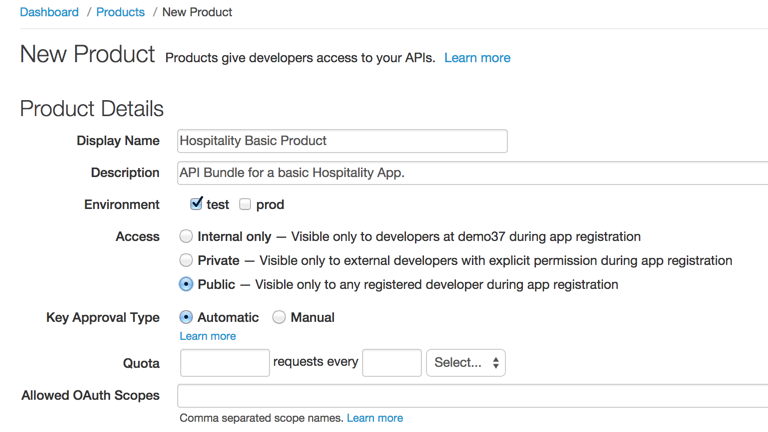
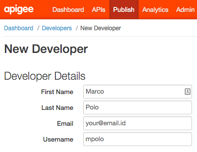
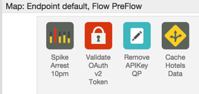
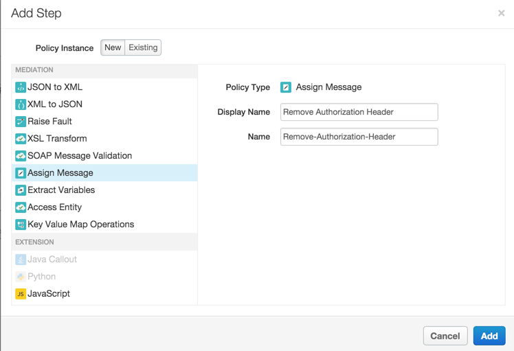
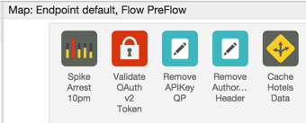
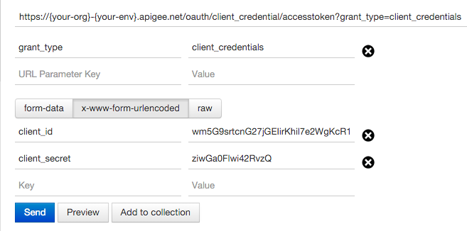
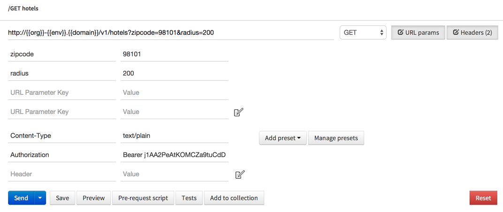

{width="8.5in" height="1.3888888888888888e-2in"}

**Appendix 3 - Securing APIs (OAuth)**

{width="6.5in" height="2.861111111111111in"}

**Overview**

There are several out-of-the-box security policies that Apigee Edge
provides to protect your APIs. These security policies must be used
appropriately based upon your use cases. Apigee Edge supports:

> ***API Keys***
>
> API key validation is the simplest form of app-based security that you
> can configure for an API. Apps simply present an API key, and Apigee
> Edge checks to see that the API key is in an approved state for the
> resource being requested. For this reason the security associated with
> API keys is limited. API keys can easily be extracted from app code
> and used to access an API. You may find that API keys work better as
> unique app identifiers than as security tokens. For more information,
> see [API Keys](http://apigee.com/docs/api-services/content/api-keys).
>
> ***OAuth v2.0***
>
> Here's the definition of OAuth from the OAuth 2.0 IETF specification.
> "The OAuth 2.0 authorization framework enables a third-party
> application to obtain limited access to an HTTP service, either on
> behalf of a resource owner by orchestrating an approval interaction
> between the resource owner and the HTTP service, or by allowing the
> third-party application to obtain access on its own behalf."
>
> All requests from the app for protected resources from the backend
> service is negotiated using an access token. Access tokens are long
> random strings generated by an authorization server after appropriate
> app and/or user credentials are presented. Tokens are used to validate
> requests for protected resources. If an app is compromised, the
> resource server can revoke it's access token. In that case, the end
> user does not need to change her username/password on the resource
> server, her app simply needs to renegotiate for a new access token.
>
> To go beyond app identification using API Keys, Apigee Edge provides
> comprehensive support for OAuth v2.0. Apigee Edge includes an OAuth
> 2.0 authorization server implementation that lets you register apps
> and secure API proxies with OAuth 2.0 using the four grant types that
> are part of OAuth 2.0. For more information, see [OAuth 2.0
> ](http://apigee.com/docs/api-services/content/oauth-introduction)and
> the [OAuth the Big
> Picture](https://pages.apigee.com/oauth-big-picture-ebook.html) Apigee
> eBook.
>
> ***OAuth v1.0a***
>
> OAuth 1.0a defines a standard protocol that enables app users to
> authorize apps to consume APIs on their behalf, without requiring app
> users to disclose their passwords to the app in the process. Apigee
> Edge enables you to protect APIs in a way that ensures that an app
> uses has authorized the app to consume an API. Edge also provides
> policy-based functionality for configuring the endpoints that app
> developers can use to obtain access tokens. For more information, see
> [OAuth
> v1.0a](http://apigee.com/docs/api-services/reference/oauth-10-policy)
> policy.

**\
*SAML***

> Apigee Edge enables you to authenticate and authorize apps that are
> capable of presenting SAML tokens. A SAML token is a digitally signed
> fragment of XML that presents a set of "assertions". These assertions
> can be used to enforce authentication and authorization.
>
> To use SAML terminology, Apigee Edge can function as a service
> provider (SP) or an Identity Provider (IP). When Apigee Edge validates
> SAML tokens on inbound requests from apps, it acts in the role of SP.
> (API Services can also act in the IP role, when generating SAML tokens
> to be used when communicating with backend services. For details on
> SAML validation, see [SAML Assertion
> policies](http://apigee.com/docs/api-services/reference/saml-assertion-policy).
>
> **Content Based Security**
>
> Message content is a significant attack vector used by malicious API
> consumers. API Services provides a set of Policy types to mitigate the
> potential for your backend services to be compromised by attackers or
> by malformed request payloads.
>
> ***JSON threat protection***
>
> JSON attacks attempt to use structures that overwhelm JSON parsers to
> crash a service and induce application-level denial-of-service
> attacks.
>
> Such attacks can be mitigated using the JSONThreatProtection Policy
> type.
>
> See [JSON Threat Protection
> policy](http://apigee.com/docs/api-services/reference/json-threat-protection-policy).
>
> ***XML threat protection***
>
> XML attacks attempt to use structures that overwhelm XML parsers to
> crash a service and induce application-level denial-of-service
> attacks.
>
> Such attacks can be mitigated using the XMLThreatProtection Policy
> type.
>
> See [XML Threat Protection
> policy](http://apigee.com/docs/api-services/reference/xml-threat-protection-policy).
>
> ***General content protection***
>
> Some content-based attacks use specific constructs in HTTP headers,
> query parameters, or payload content to attempt to execute code. An
> example is SQL-injection attacks. Such attacks can be mitigated using
> the Regular Expression Protection Policy type.
>
> See [Regular Expression Protection
> policy](http://apigee.com/docs/api-services/reference/regular-expression-protection).
>
> **Data Masking**
>
> Apigee Edge enables developers to capture message content to enable
> runtime debugging of APIs calls. In many cases, API traffic contains
> sensitive data, such credit cards or personally identifiable health
> information (PHI) that needs to filtered out of the captured message
> content.
>
> To meet this requirement, Edge defines 'mask configurations' that
> enable you to specify data that will be filtered out of trace
> sessions. Masking configurations can be set globally (at the
> organization-level) or locally (at the API proxy level). Role-based
> capabilities govern which users have access to the data that is
> defined as sensitive.
>
> For more information, see [Data
> Masking](http://apigee.com/docs/api-services/content/data-masking)[
> ](http://apigee.com/docs/api-services/content/data-masking)

**Objectives**

The objective of this lesson is to get you familiar with Apigee Edge
OAuth 2.0 Token Validation policies.

In the earlier lab, we saw how API Keys help in identifying the
consumer. Identifying an API consumer is beneficial from an analytics
and audit perspective, but in many situations, simply identifying the
API consumer is not secure enough. To add an additional level of
security, in this lesson you will replace the API Key Verification
policy with an OAuth 2.0 Token Validation policy using the
client-credentials two-legged OAuth flow.

**Prerequisites**

-   At a minimum, Lab 1 is completed.

-   A preliminary understanding of OAuth 2.0.

-   Apigee Oauth proxy deployed to your organization.

**Estimated Time: 60 mins\
**

1)  **Publishing APIs\
    > **

> To make it easier for Developers to consume APIs, Apigee Edge provides
> the capability of publishing APIs. *Publishing* is the process of
> making your APIs available to Developers for consumption. Publishing
> APIs can be broadly defined by the following tasks:

-   Create the *API Products* on Apigee Edge that bundle your APIs.

-   Register *Developers* on Edge. Only a registered App Developer can
    > register an App.

-   *Developers* register *Developer Apps* on Edge to access
    > API products. In response, the developer receives an API key. Now
    > that the developer has an API key, they can make requests to
    > your APIs.

> For more, see [Publishing
> Overview](http://apigee.com/docs/developer-services/content/publishing-overview).
>
> The following table defines some of the terms used to register apps
> and generate keys:

  Term              Definition
  ----------------- ---------------------------------------------------------------------------------------------------------------------------------------------------------------------------------------------------------------------------------------------------------------------------------------------------------------------------------------------------------------------------------------
  **API product**   A bundle of API proxies combined with a service plan that sets limits on access to those APIs. API products are the central mechanism that Apigee Edge uses for authorization and access control to your APIs. For more, see [API Products](http://apigee.com/docs/developer-services/content/what-api-product)
  **Developer**     The API consumer. Developers write apps the make requests to your APIs. For more, see Developer
  **App**           A client-side app that a developer registers to access an API product. Registering the app with the API product generates the API key for accessing the APIs in that product.
  **API key**       A string with authorization information that a client-side app uses to access the resources exposed by the API product. The API key is generated when a registered app is associated with an API product.

> With the above brief introduction to API Products, Developers and
> Developer Apps, you will now create one of each to obtain a valid API
> Key that can be used to call your proxy

NOTE : If you have already created a Product as part of the lab-3, you
can skip this step.

a.  **Publishing an API Product**

    i.  From the Apigee Edge Management UI, go to Publish → API Products

    ii. Click on ‘+ Product’ button to add a new product

    iii. In the ‘Product Details’ section of the new product screen,
        > enter or select the following values for the various fields:

        -   Display Name: **{Your\_Initials}\_Hospitality Basic
            > Product**

        -   Description: **API Bundle for a basic Hospitality App.**

        -   Environment: **Test**

        -   Access: **Public**

        -   Key Approval Type: **Automatic**

> {width="3.9166666666666665in"
> height="2.2015791776027998in"}

i.  In the ‘Resources’ section select the following values for the
    > various fields:

    -   API Proxy: **{your\_initial}\_hotels**

    -   Revision: **1**

    -   Resource Path: **/**

> {width="4.473958880139983in"
> height="0.48608377077865267in"}

i.  Click on ‘Import Resources’ to add the ‘/’ resource of your proxy to
    > the API product

ii. **Repeat** the above two steps for the ‘/\*\*’ resource

iii. Click ‘Save’ to save the API Product. The new product should now be
    > listed on the ‘Products’ page.

NOTE : If you have already registered a Developer account as part of the
lab-3, you can skip this step.

a.  **Registering a Developer**

> Developers access your APIs through apps. When the developer registers
> an app, they receive a single API key that allows them to access all
> of the API products associated with the app. However, developers must
> be registered before they can register an app.
>
> Developers typically have several ways of registering:

-   If you have a paid Edge account, through a Developer
    > Services portal. See [Add and manage user
    > accounts](http://apigee.com/docs/developer-services/content/add-and-manage-user-accounts)
    > for more.

<!-- -->

-   By accessing a form that uses the Edge management API to register
    > the developer. See [Using the Edge management API to Publish
    > APIs](http://apigee.com/docs/developers-services/content/using-edge-management-api-publish-apis)
    > for more.

-   By a back-end administrator using the Edge management UI.

> You will be learning more about how Developers can go through a
> self-service registration process using Developer Services Portal in
> later lessons. For the continuity of this lesson, the following steps
> describe the process of registering Developers and Developer Apps
> using the Apigee Edge Management UI.

i.  From the Apigee Edge Management UI, go to Publish → Developers

ii. Click on ‘+ Developer’ button to add a new product

iii. Add a new developer with the following properties:

    -   First Name: **Your First Name**

    -   Last Name: **Your Last Name**

    -   Email: **{your email\_id}**

    -   Username: **{firstname\_lastname}**

> {width="3.6614588801399823in"
> height="2.824290244969379in"}

i.  Click ‘Save’ to save the Developer. The new developer should now be
    > listed on the ‘Developer’ page.

NOTE : If you have already created a Developer App as part of the lab-3,
you can skip this step.

a.  **Registering a Developer App**

> Now that you have an API product and a developer, you can register a
> Developer App with the API product. Registering the Developer App
> generates the API key for the API products associated with the app.
> You can then distribute the key to app developers so they can access
> the features in the API products from the app.
>
> As mentioned earlier, you will learn about self-registering apps as a
> developer using Developer Services Portal in later lessons. For the
> continuity of this lesson, the following steps describe the process of
> registering Developer Apps using the Apigee Edge Management UI.

i.  From the Apigee Edge Management UI, go to Publish → Developer Apps

ii. Click on ‘+ Developer App’ button to add a new product

iii. In the ‘Developer App Details’ section, enter or select the
    > following values for the various fields:

    -   Display Name: **{Your\_Initials}\_iExplore App**

    -   Developer: **{Your\_name}**

    -   Callback URL: **Leave it blank**

iv. In the ‘Products’ section, click on the ‘+ Product’ button

v.  From the ‘Product’ drop-down, select the product you created.

vi. Click the ‘check-mark’ button in the ‘Actions’ column to accept the
    > changes

> {width="4.432292213473316in"
> height="0.6463757655293089in"}

i.  Click ‘Save’ to save the Developer App. The new app should now be
    > listed on the ‘Developer Apps’ page

ii. From the ‘Developer Apps’ page, select your App.

iii. In the ‘Products’ section, next to the entry for
    > ‘{Your\_Initials}\_Hospitality Basic Product,’ click ‘Show’ in the
    > ‘Consumer Key’ and ‘Consumer Secret’ columns to display the
    > generated keys

> **Note:** Since you selected ‘Key Approval Type: Automatic’ when you
> created the API product, the API key is automatically approved and you
> can view it immediately
>
> If you had selected ‘Approval Type: Manual,’ you would need to click
> ‘Approve’ in the ‘Actions’ column to approve the API key.
>
> The way your proxy is configured, as of now, the Consumer Key (i.e.
> the API Key) is the only key that the your App will need to access the
> proxy resources. You will use the Consumer Secret (i.e. the API
> Secret) in the next section when the security policy is changed from
> API Key Verification to an OAuth Token Validation policy.

1)  **Add security using OAuth 2.0: Client Credentials Grant**

> For convenience, all organizations on Apigee Edge come preconfigured
> with a set of OAuth 2.0 endpoints that implement the ‘client
> credentials grant type’. For information about the configuration of
> the default ‘oauth’ proxy, review [policies in the oauth token
> endpoint](http://apigee.com/docs/api-services/tutorials/secure-calls-your-api-through-oauth-20-client-credentials).
>
> This section of the lesson explains how to protect an API using this
> default ‘oauth’ proxy configuration.
>
> **About the client credentials grant type**
>
> The client credentials grant type defines a procedure for issuing
> access tokens in exchange for *App credentials*. These app credentials
> are the consumer key and secret pair that Apigee Edge issues for each
> app that is registered in an organization.
>
> For this reason, it is relatively simple to 'step up' your API
> security scheme from API key validation to OAuth client credentials.
> Both schemes use the same consumer key and secret to validate the
> client app. The difference is that client credentials provides an
> extra layer of control, since you can easily revoke an access token
> when needed, without requiring you to revoke the app's consumer key.
> To work with the default OAuth endpoints, you can use any consumer key
> and secret generated for app in your organization to retrieve access
> tokens from the token endpoint. You can even enable client credentials
> for apps that already have consumer keys and secrets.
>
> Client credentials has very specific use cases, and is not the grant
> type most commonly used for web and mobile apps. For a general
> introduction to OAuth 2.0 grant types with definitions and use cases,
> see [Introduction to OAuth
> 2.0](http://apigee.com/docs/api-services/content/oauth-introduction).
>
> To support use cases with grant types other than client credentials,
> the OAuth proxy must be configured with authorization endpoints. For
> additional information, see [configuring authorization
> endpoints](http://apigee.com/docs/api-services/content/oauth-endpoints)
> and [authorizing requests using OAuth
> 2.0](http://apigee.com/docs/api-services/reference/authorize-requests-using-oauth-20).

a.  **Adding an OAuth 2.0 Token Validation Policy **

    i.  Go to the Apigee Edge Management UI browser tab

    ii. Since you will be adding an OAuth v2.0 policy, the API Key
        > Verification policy is no longer necessary. Delete the ‘Verify
        > API Key’ policy from the ‘{your\_initials}\_hotels’ proxy
        > default proxy endpoint preflow.

> {width="1.4169728783902011in"
> height="0.9635422134733158in"}

i.  Using the “+Step” from the ‘Develop’ tab of the
    > ‘{your\_initials}\_hotels’ proxy, add the ‘OAuth v2.0’ policy with
    > the following properties:

    -   Policy Display Name: **Validate OAuth v2 Token**

    -   Policy Name: **Validate-OAuth-v2-Token**

> {width="4.786458880139983in"
> height="3.2842760279965004in"}

i.  The ‘Validate OAuth v2 Token’ policy will get added after the
    > ‘Response Cache’ policy. **Drag and move** the ‘Validate OAuth v2
    > Token’ policy to be before the ‘Remove APIKey QP’ policy

> {width="3.0104166666666665in"
> height="1.4270833333333333in"}

i.  Review the XML configuration and/or the properties associated with
    > the ‘Validate OAuth v2 Token’ policy.

  -----------------------------------------------------------------------------------------------------
  &lt;?xml version="1.0" encoding="UTF-8" standalone="yes"?&gt;

  &lt;OAuthV2 async="false" continueOnError="false" enabled="true" name="Validate-OAuth-v2-Token"&gt;

  &lt;DisplayName&gt;Validate OAuth v2 Token&lt;/DisplayName&gt;

  &lt;FaultRules/&gt;

  &lt;Properties/&gt;

  &lt;Attributes/&gt;

  &lt;ExternalAuthorization&gt;false&lt;/ExternalAuthorization&gt;

  &lt;Operation&gt;VerifyAccessToken&lt;/Operation&gt;

  &lt;SupportedGrantTypes/&gt;

  &lt;GenerateResponse enabled="true"/&gt;

  &lt;Tokens/&gt;

  &lt;/OAuthV2&gt;
  -----------------------------------------------------------------------------------------------------
  -----------------------------------------------------------------------------------------------------

> *(You can find the policy xml*
> [**here**](https://gist.github.com/prithpal/45e6e50683b53685ebc6)*.
> Click the “Raw” button and copy/paste into your policy editor).*
>
> The value of the &lt;Operation&gt; element indicates the action to
> take - in this case, verification of the access token.
>
> The value of the &lt;ExternalAuthorization&gt; element is set to
> ‘false,’ indicating that Apigee Edge should validate the OAuth Token
> rather than delegating it to an external validator.

a.  **Removing the Authorization Header After Validating the OAuth Token
    > **

    i.  Using “+ Step” from the “Develop” tab of the
        > ‘{your\_initials}\_hotels’ proxy, add the ‘Assign Message’
        > policy with the following properties on the Proxy End point,
        > Request flow :

        -   Policy Display Name:**Remove Authorization Header**

        -   Policy Name: **Remove-Authorization-Header**

> {width="4.619792213473316in"
> height="3.161299212598425in"}

i.  The ‘Remove Authorization Header’ policy will get added after the
    > ‘Response Cache’ policy. **Drag and move** the ‘Remove
    > Authorization Header’ policy to be before the ‘Response Cache’
    > policy

> {width="2.6979166666666665in"
> height="1.0871019247594051in"}

a.  For the ‘Remove Authorization Header’ policy, change the XML
    > configuration of the policy using the ‘Code: Remove Authorization
    > Header’ panel as follows:

  ---------------------------------------------------------------------------------------------------------------
  &lt;?xml version="1.0" encoding="UTF-8" standalone="yes"?&gt;

  &lt;AssignMessage async="false" continueOnError="false" enabled="true" name="Remove-Authorization-Header"&gt;

  &lt;DisplayName&gt;Remove Authorization Header&lt;/DisplayName&gt;

  &lt;Remove&gt;

  &lt;Headers&gt;

  &lt;Header name="Authorization"&gt;&lt;/Header&gt;

  &lt;/Headers&gt;

  &lt;/Remove&gt;

  &lt;IgnoreUnresolvedVariables&gt;true&lt;/IgnoreUnresolvedVariables&gt;

  &lt;AssignTo createNew="false" transport="http" type="request"/&gt;

  &lt;/AssignMessage&gt;
  ---------------------------------------------------------------------------------------------------------------
  ---------------------------------------------------------------------------------------------------------------

> *(You can find the policy xml*
> [**here**](https://gist.github.com/prithpal/aaee5179e37a18a6d9ea)*.
> Click the “Raw” button and copy/paste into your policy editor).*
>
> As a security measure, the ‘Remove Authorization Header’ policy
> removes the ‘Authorization’ header from the HTTP request message so it
> is not sent to the backend service. In fact, if the ‘Authorization’
> header is not removed, the Backend-as-a-Service API will throw an
> invalid token error.
>
> Note : You could also have this functionality as part of the “Remove
> APIKey QP” policy.

a.  **Testing the OAuth 2.0 Token Validation Policy without a Token**

    i.  Copy the ‘Consumer Key’ associated with the
        > ‘{your\_initials}\_iExplore App’ by going to Publish →
        > Developer Apps → {your\_initials}\_iExplore App

    ii. Start a Trace session for the ‘{your\_initials}\_hotels’ proxy

    iii. Send a test ‘/GET hotels’ request from Postman with the
        > following query parameters:
        > zipcode=98101&radius=200&apikey=**{Your\_Initials}\_iExplore
        > App Consumer Key.**

> **Note :**
>
> Replace ‘hotels’ API proxy to point to **{your\_initials}**\_hotel

i.  As expected, a fault will be returned since a valid OAuth Token has
    > not been provided as part of the request:

  ------------------------------------------
  {

  fault: {

  faultstring: "Invalid access token",

  detail: {

  errorcode: "oauth.v2.InvalidAccessToken"

  }

  }

  }
  ------------------------------------------
  ------------------------------------------

> The above response shows that the API Key Verification policy is being
> enforced as expected.

i.  Review the Trace for the proxy and the returned response to ensure
    > that the flow is working as expected.

ii. Stop the Trace session for the ‘{your\_initials}\_hotels’ proxy

<!-- -->

a.  **Testing the OAuth 2.0 Token Validation Policy with a Valid Token**

    i.  You will obtain a valid oauth token by directly calling the
        > ’oauth’ API proxy token endpoint and passing the consumer key
        > and consumer secret of the ‘{your\_initials}\_iExplore
        > App’ app.

    ii. Send a test ‘/POST OAuth Token - Client Cred’ request from
        > Postman after setting appropriate values in the
        > ‘x-www-form-urlencoded’ section of the request:

        -   client\_id: **{your\_initials}\_iExplore App Consumer Key**

        -   client\_secret: **{your\_initials}\_iExplore App Consumer
            > Secret**

        -   grant\_type: **client\_credentials (this should be added as
            > query param)**

> {width="4.755208880139983in"
> height="2.354743000874891in"}
>
> **Note**: Copy-paste the Consumer Key and Consumer Secret from the
> {your\_initials}\_iExplore App’s detail page. As you copy-paste,
> remove any spaces before and after the values of the Consumer Key and
> Consumer Secret.

i.  Review the response of the ‘/POST OAuth Token - Client
    > Cred’ request. Copy the value of the ‘access\_token’ attribute to
    > use in the next step.

  ------------------------------------------------------------
  {

  issued\_at: "1414962637000",

  application\_name: "ef723b8b-fdb1-4aae-9418-096d8ab7fec7",

  scope: "",

  status: "approved",

  api\_product\_list: "\[Hospitality\]",

  expires\_in: "3599",

  developer.email: "your@email.id",

  organization\_id: "0",

  token\_type: "BearerToken",

  client\_id: "P24PNGrXN0gTNdVi6giT12Dq0vrG3ruB",

  access\_token: "**j1AA2PeAtKOMCZa9tuCdDDsRqn8J**",

  organization\_name: "demo37",

  refresh\_token\_expires\_in: "0",

  refresh\_count: "0"

  }
  ------------------------------------------------------------
  ------------------------------------------------------------

i.  Start a Trace session for the ‘{your\_initials}\_hotels’ proxy

ii. Set up the ‘/GET hotels’ request in Postman with the following query
    > parameters **AND header**:

-   **Query Parameters**:

    -   zipcode: **98101**

    -   radius: **200**

-   **Header:**

    -   Authorization**: Bearer {access\_token}**

> {width="4.630208880139983in"
> height="1.9515135608048995in"}
>
> **Note**:

-   Replace the API proxy URL with **{your\_initials}**\_hotels URL.

-   Replace the **{access\_token}** with the value of the
    > ‘access\_token’ from the response in the step above.

    i.  Send the Postman request.

    ii. Review the Trace for the proxy and the returned response to
        > ensure that the flow is working as expected.

    iii. Stop the Trace session for the ‘{your\_initials}\_hotels’ proxy

**Summary**

That completes this hands-on lesson. In this lesson you learned about
the various out-of-the-box security related policies that are available
in Apigee Edge and to leverage a couple of those policies - API Key
Verification and OAuth 2.0 client credentials grant - to secure your
APIs.
