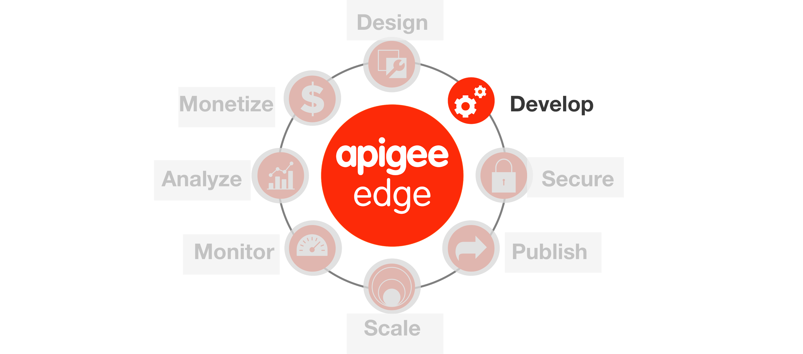
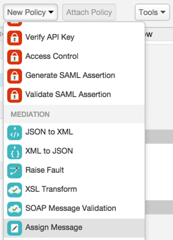
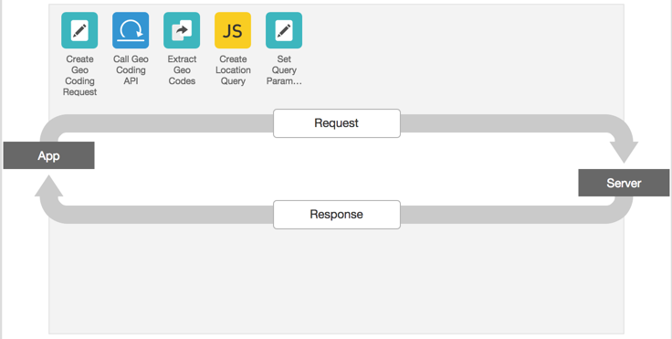
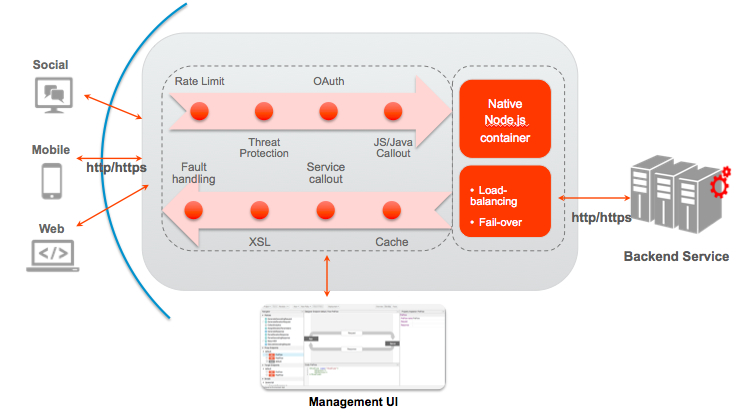
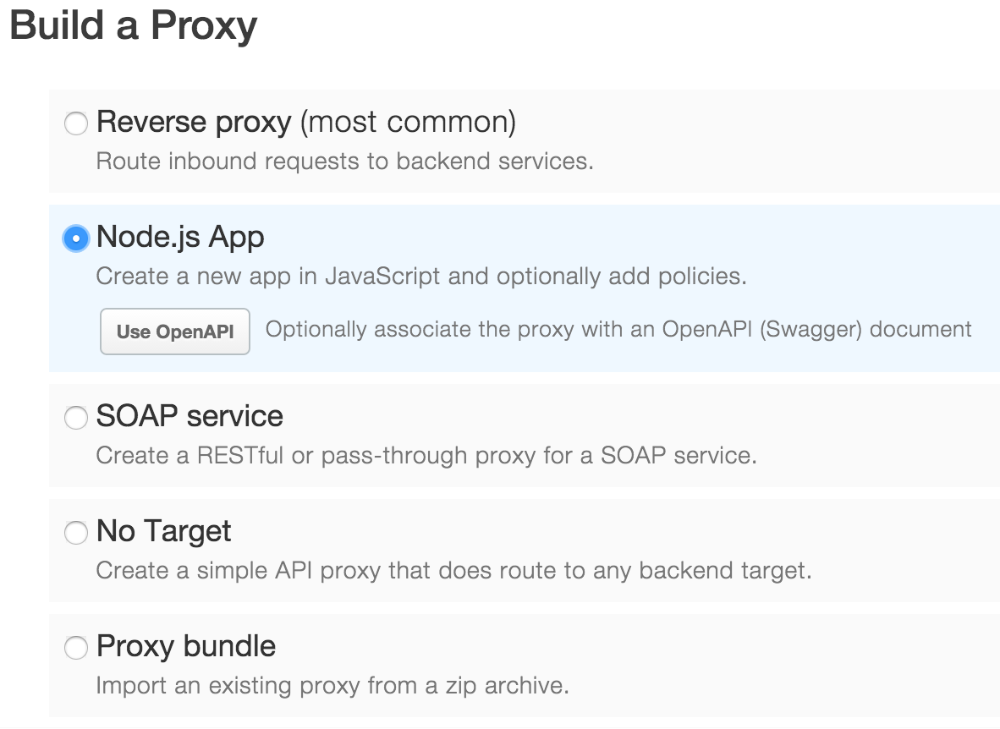
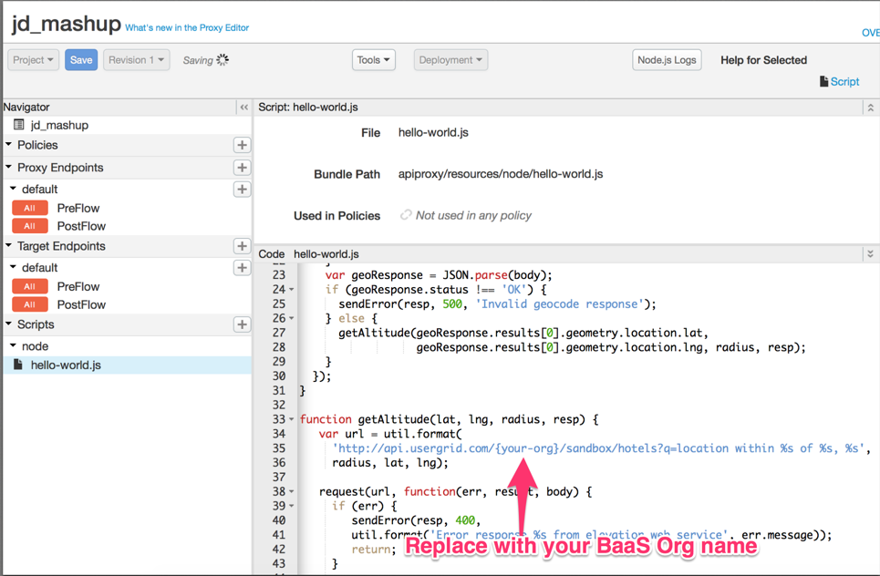

**Lab 4 - Creating Composite APIs**

**Overview**

Apigee Edge enables you to 'program' API behavior by using out of the
box 'policies'. A policy is like a module that implements a specific,
limited management function. Policies are designed to let you add common
types of management capabilities to an API easily and reliably. Policies
provide features like security, rate-limiting, transformation, and
mediation capabilities, saving you from having to code and maintain this
functionality on your own.

You're not limited to the set of policy types provided by Apigee Edge.
You can also write custom scripts and code (such as JavaScript and
Node.js applications), that extend API proxy functionality and enable
you to innovate on top of the basic management capabilities supported by
Apigee Policies (*In a later section in this lab we will show how you
can accomplish building mashups using powerful **node.js capabilities in
Edge***).

Policy types
------------

> Technically, a policy is an XML-formatted configuration file. Each
> policy type's structure (for example, the required and optional
> configuration elements) is defined by an XML schema.
>
> Edge Policy types are grouped into the following functional
> categories:

### *Traffic management*

> Policies in the traffic management category enable you to control the
> flow of request and response messages through an API proxy. These
> policies support both operational- and business-level control. They
> give you control over raw throughput, and can also control traffic on
> a per-app basis. Traffic management policy types enable you to enforce
> quotas, and they also help you to mitigate denial of service attacks.

### *Mediation*

> Policies in the mediation category enable you to actively manipulate
> messages as they flow through API proxies. They enable you to
> transform message formats, from XML to JSON (and vice-versa), or to
> transform one XML format to another XML format. They also enable you
> to parse messages, to generate new messages and to change values on
> outbound messages. Mediation policies also interact with basic
> services exposed by API Services, enabling you to retrieve data about
> apps, developers, security tokens, and API products at runtime.

### *Security*

> Policies in the security category support authentication,
> authorization, as well as content-based security.

### *Extension* 

> Policies in the extension category enable you to tap into the
> extensibility of API Services to implement custom behavior in the
> programming language of your choice.
>
> Each Policy type is documented in detail in the [Policy reference
> overview](http://apigee.com/docs/api-services/reference/reference-overview-policy).
> This topic demonstrates general interaction, showing you how to create
> Policies, and how to attach them to Flows in an API proxy
> configuration.

**Objectives**

The goal of this lesson is to get you familiar with how to use the
Management UI to design and configure different types of policies to the
API Proxy that we created in the previous lab. We will primarily work
with mediation and extensibility policies in this lesson.

By the end of this lesson, you will have enhanced your proxy to accept a
‘zipcode’ and a ‘radius’ (in meters) query parameter, use those
parameters to return a list of hotels that match the criteria, and
format the results to filter out some metadata from the BaaS result.

**Note**: Now that you are familiar with the Apigee Edge Management UI
navigation, the instructions will become terse and will be provided
without screenshots unless a new concept is being introduced.

**Prerequisites**

-   Lab 3 is completed

**Estimated Time : 45 mins**

1)  **Adding Resources to a Policy** is done from the ‘Overview’ tab of
    the API Proxy

    a.  Go to the Apigee Edge Management UI browser tab

    b.  Go to the ‘{your\_initials}\_hotel’ proxy’s ‘Overview’ tab.

    c.  Switch to classic proxy editor screen by clicking on "access the
        classic version of proxy editor" on the top right corner.

    d.  From the ‘resources’ section, click on the ‘+ Resources’ button

    e.  In the new resource row, provide the following properties:

        -   Name: **Get Individual Hotel**

        -   Proxy Endpoint: **Default**

        -   Method: **GET**

        -   Path: **/{hotel-uuid}**

> 

a.  Add another resource with the following properties:

    -   Name: **Get Hotels**

    -   Proxy Endpoint: **Default**

    -   Method: **GET**

    -   Path: **/**

    -   After setting those properties, click on the ‘Checkbox’ in the
        ‘Actions’ column to complete adding the resource

    -   Click on Save

<!-- -->

1)  **Adding Policies to a Proxy** is done from the ‘Develop’ tab of the
    API Proxy.

    a.  Now that you have an API Proxy configured with a couple of
        resources, you will add logic to the ‘Get Hotels’ resource
        using policies.

> The goal is to have the proxy perform a geolocation query against our
> ‘hotels’ BaaS data collection to return results within a certain
> radius of a zipcode (zipcode and radius both being query parameters
> provided when calling the ‘/v1/{your\_initials}\_hotels’ API).
>
> API BaaS supports the ability to retrieve entities within a specified
> distance of any geocoordinate based on its location property:
>
> location within &lt;distance\_in\_meters&gt; of &lt;latitude&gt;,
> &lt;longitude&gt;
>
> As you can see, you need to provide the latitude and longitude
> information to perform the query.
>
> For mobile applications meant for smartphones, obtaining geocode
> information is easy and can be provided directly as part of an API
> call. For this lesson, assume that this API interface is being created
> for devices and applications that cannot easily provide the
> geocoordinate information, but simply requests the user to provide the
> zipcode. In such a situation, the first thing is to obtain the
> geo-coordinates for the zipcode provided before doing further
> processing. Below are the high level steps to implement this in the
> proxy:

-   Retrieve the zipcode and radius from the request query parameters

-   Use the zipcode as an input parameter to call an external service
    that converts the zipcode to the geo-coordinates

-   Extract the latitude and longitude geo-coordinates information from
    the response of the external service call

-   Use the geo-coordinates to create the geo-location query

-   Add the location query as a query parameter before the target BaaS
    service is invoked

> A pictorial representation of the logic is depicted below:

> For the service callout to convert the zipcode to the geocoordinate,
> you will use the [*Google GeoCoding
> API*](https://developers.google.com/maps/documentation/geocoding/).
>
> Now let’s implement the policies.

a.  Switch to the ‘Develop’ tab of the API Proxy

b.  From the ‘Navigator’ pane, select ‘Proxy Endpoints → Default → Get
    Hotels’

<!-- -->

1)  **Using Assign Message Policy to prepare the service callout
    request**

    a.  From the ‘New Policy’ drop-down, select the ‘Assign Message’
        policy

> 

a.  In the ‘New Policy - Assign Message’ dialog box provide the
    following information:

    -   Policy Display Name: **Create Geo Coding Request**

    -   Policy Name: **Create-Geo-Coding-Request**

    -   Attach Policy: **Checked**

    -   Flow: **Flow Get Hotels, Proxy Endpoint default**

    -   Segment: **Request**

b.  Click on the ‘Create Geo Coding Request’ policy in the pipeline and
    modify the XML configuration in the ‘Code:
    Create-Geo-Coding-Request’ section, which appears underneath the Map
    as follows:

  -------------------------------------------------------------------------------------------------------------
  &lt;?xml version="1.0" encoding="UTF-8" standalone="yes"?&gt;

  &lt;AssignMessage async="false" continueOnError="false" enabled="true" name="Create-Geo-Coding-Request"&gt;

  &lt;DisplayName&gt;Create Geo Coding Request&lt;/DisplayName&gt;

  &lt;AssignTo createNew="true" type="request"&gt;GeoCodingRequest&lt;/AssignTo&gt;

  &lt;Set&gt;

  &lt;QueryParams&gt;

  &lt;QueryParam name="address"&gt;{request.queryparam.zipcode}&lt;/QueryParam&gt;

  &lt;QueryParam name="region"&gt;US&lt;/QueryParam&gt;

  &lt;QueryParam name="sensor"&gt;false&lt;/QueryParam&gt;

  &lt;/QueryParams&gt;

  &lt;Verb&gt;GET&lt;/Verb&gt;

  &lt;/Set&gt;

  &lt;!-- Set variables for use in the flow --&gt;

  &lt;AssignVariable&gt;

  &lt;Name&gt;zipcode&lt;/Name&gt;

  &lt;Ref&gt;request.queryparam.zipcode&lt;/Ref&gt;

  &lt;/AssignVariable&gt;

  &lt;AssignVariable&gt;

  &lt;Name&gt;radius&lt;/Name&gt;

  &lt;Value&gt;0&lt;/Value&gt;

  &lt;Ref&gt;request.queryparam.radius&lt;/Ref&gt;

  &lt;/AssignVariable&gt;

  &lt;/AssignMessage&gt;
  -------------------------------------------------------------------------------------------------------------

> *(You can find the policy xml*
> [**here**](https://gist.github.com/prithpal/f3222b3f220c6fa18e13)*.
> Click the “Raw” button and copy/paste into your policy editor).*
>
> Here's a brief description of the elements in this policy. You can
> read more about this policy in [Assign Message
> policy](http://apigee.com/docs/api-services/reference/assign-message-policy).
>
> **&lt;AssignMessage name&gt;** - Gives this policy a name. The name is
> used when the policy is referenced in a flow.
>
> **&lt;AssignTo&gt;** - Creates a named variable called
> ’GeoCodingRequest’of type ‘Request’. This variable encapsulates the
> request object that will be sent by the ServiceCallout policy.
>
> **&lt;Set&gt;&lt;QueryParams&gt;** - Sets the query parameters that
> are needed for the service callout API call. In this case, the Google
> Geocoding API needs to know the location, which is expressed with a
> zipcode. The API calling client supplies this information, and we
> simply extract it here. The region and sensor parameters are by the
> API, and we just hardcode it to certain values here.
>
> **&lt;Verb&gt;** - In this case, we are making a simple GET request to
> the API.
>
> **&lt;AssignVariable&gt;** - zipcode and radius are new variables
> being created to store values being passed to the API. In this
> example, the variables will be accessed later in the proxy flow.
>
> **Note**: The properties associated with the ‘Assign Message’ policy
> could have been modified using the ‘Property Inspector’ panel that’s
> presented in the ‘Develop’ tab on the right. Any changes made in the
> ‘Code’ panel are reflected in the ‘Property Inspector’ panel and
> vice-versa. We will use the ‘Property Inspector’ panel to set
> properties for some of the policies as the lesson progresses.

1)  **Using the Service Callout Policy to invoke the Google GeoCoding
    API**

    a.  From the ‘New Policy’ drop-down, select the ‘Service Callout’
        policy and add it with the following properties:

        -   Policy Display Name: **Call Geo Coding API**

        -   Policy Name: **Call-Geo-Coding-API**

        -   Attach Policy: **Checked**

        -   Flow: **Flow Get Hotels, Proxy Endpoint default**

        -   Segment: **Request**

    b.  For the ‘Call Geo Coding API’ policy, change the values of the
        following properties in the ‘Property Inspector’:

        -   Request variable: **GeoCodingRequest**

        -   Response: **GeoCodingResponse**

        -   URL: **http://maps.googleapis.com/maps/api/geocode/json**

> *(You can find the policy xml*
> [**here**](https://gist.github.com/prithpal/41fd17d267f279a53c01)*.
> Click the “Raw” button and copy/paste into your policy editor).*
>
> Here's a brief description of the elements that were modified in this
> policy. You can read more about this policy in [Service Callout
> policy](http://apigee.com/docs/api-services/reference/service-callout-policy).
>
> **&lt;Request variable&gt;** - This is the variable ‘GeoCodingRequest’
> that was created in the AssignMessage policy in the previous step. It
> encapsulates the request going to the Google Geocoding API.
>
> **&lt;Response&gt;** - This element names a variable
> ‘GeoCodingResponse’ in which the response from the Google Geocoding
> API will be stored. As you will see, this variable will be accessed
> later by the ExtractVariables policy.
>
> **&lt;HTTPTargetConnection&gt;&lt;URL&gt;** - Specifies the target URL
> to be used by the service callout - in this case the URL of the Google
> Geocoding API: ‘http://maps.googleapis.com/maps/api/geocode/json’

1)  **Using the Extract Message Policy to parse the service callout
    response**

    a.  From the ‘New Policy’ drop-down, select the ‘Extract Variables’
        policy and add it with the following properties:

        -   Policy Display Name: **Extract Geo Codes**

        -   Policy Name: **Extract-Geo-Codes**

        -   Attach Policy: **Checked**

        -   Flow: **Flow Get Hotels, Proxy Endpoint default**

        -   Segment: **Request**

    b.  For the ‘Extract Geo Codes’ policy, change the XML configuration
        of the policy using the ‘Code: Extract Geo Codes’ panel as
        follows:

  --------------------------------------------------------------------------------------------------------
  &lt;?xml version="1.0" encoding="UTF-8" standalone="yes"?&gt;

  &lt;ExtractVariables async="false" continueOnError="false" enabled="true" name="Extract-Geo-Codes"&gt;

  &lt;DisplayName&gt;Extract Geo Codes&lt;/DisplayName&gt;

  &lt;Source&gt;GeoCodingResponse&lt;/Source&gt;

  &lt;VariablePrefix&gt;geocodeResponse&lt;/VariablePrefix&gt;

  &lt;JSONPayload&gt;

  &lt;Variable name="latitude"&gt;

  &lt;JSONPath&gt;\$.results\[0\].geometry.location.lat&lt;/JSONPath&gt;

  &lt;/Variable&gt;

  &lt;Variable name="longitude"&gt;

  &lt;JSONPath&gt;\$.results\[0\].geometry.location.lng&lt;/JSONPath&gt;

  &lt;/Variable&gt;

  &lt;/JSONPayload&gt;

  &lt;/ExtractVariables&gt;
  --------------------------------------------------------------------------------------------------------

> *(You can find the policy xml*
> [**here**](https://gist.github.com/prithpal/d97146f2c30160992256)*.
> Click the “Raw” button and copy/paste into your policy editor).*
>
> Here's a brief description of the elements that were modified in this
> policy. You can read more about this policy in [Extract Variables
> policy](http://apigee.com/docs/api-services/reference/extract-variables-policy).
>
> **&lt;Source&gt;** - Specifies the response variable
> ‘GeoCodingResponse’ that we created in the ServiceCallout policy. This
> is the variable from which this policy extracts data.
>
> **&lt;VariablePrefix&gt;** - The variable prefix ‘geocodeResponse’
> specifies a namespace for other variables created in this policy. The
> prefix can be any name, except for the reserved names defined by the
> [Apigee Edge Platform's predefined
> variables](http://mktg-dev.apigee.com/docs/api-platform/api/variables-reference).
>
> **&lt;JSONPayload&gt;** - This element retrieves the response data
> that is of interest and puts it into named variables. In fact, the
> Google Geocoding API returns much more information than latitude and
> longitude. However, these are the only values needed for these
> lessons. You can see a complete rendering of the JSON in the [Google
> Geocoding API
> documentation](https://developers.google.com/maps/documentation/geocoding/).
> The values of geometry.location.lat and geometry.location.lng are
> simply two of the many fields in the returned JSON object.
>
> It may not be obvious, but it's important to see that ExtractVariables
> produces two variables whose names consist of the variable prefix
> (geocodeResponse) and the actual variable names that are specified in
> the policy. These variables are stored in the API proxy and will be
> available to other policies within the proxy flow, as you will see.
> The variables are: geocodeResponse.latitude &
> geocodeResponse.longitude

1)  **Using the Javascript Policy to create the Location Query to send
    to the BaaS target endpoint**

    a.  From the ‘New Policy’ drop-down, select the ‘Javascript’ policy
        and add it with the following properties:

        -   Policy Display Name: **Create Location Query**

        -   Policy Name: **Create-Location-Query**

        -   Script File: **Create new script**

        -   Script Name: **Create-Location-Query.js**

        -   Attach Policy: **Checked**

        -   Flow: **Flow Get Hotels, Proxy Endpoint default**

        -   Segment: **Request**

    b.  Once the policy has been added, from the ‘Navigator’ panel go to
        ‘Scripts → Javascript’ section and select the
        ‘Create-Location-Query.js’ script file

    c.  Add the following code to the ‘Create-Location-Query.js’ script
        in the ‘Code: Create Location Query’ panel:

  ---------------------------------------------------------------------------------
  var latitude = context.getVariable("geocodeResponse.latitude"),

  longitude = context.getVariable("geocodeResponse.longitude"),

  radius = context.getVariable("radius");

  // set default (0 meters)

  radius = (radius == "") ? "0" : radius;

  // set BaaS query

  var baasQL = "location within " + radius + " of " + latitude + "," + longitude;

  context.setVariable("baasQL", baasQL);
  ---------------------------------------------------------------------------------

> *(You can find the javascript file content*
> [**here**](https://gist.github.com/prithpal/680ca505dbacc267d1dd)*.
> Click the “Raw” button and copy/paste into your policy editor).*
>
> This Javascript code uses the ‘context’ object, which is part of the
> [Apigee Edge Javascript object
> model](http://apigee.com/docs/api-services/reference/javascript-object-model)
> to retrieve 3 variables - geocodeResponse.latitude,
> geoCodeResponse.latitude, radius - that were set by policies earlier
> in the flow.
>
> It sets a default in case the variables are empty strings, creates a
> new query variable called ‘baasQL’ using the API BaaS query language
> syntax for a location query, and adds the ‘baasQL’ variable to the
> ‘context’ object to be used later in the flow by the Assign Message
> policy to set the query parameter before the API BaaS target endpoint
> is invoked.
>
> You can read more about this policy in [Javascript
> policy](http://apigee.com/docs/api-services/reference/javascript-policy).

1)  **Using the Assign Message Policy to add the Location Query to the
    query parameter before BaaS target endpoint invocation**

    a.  From the ‘New Policy’ drop-down, select the ‘Assign Message’
        policy and add it with the following properties:

        -   Policy Display Name: **Set Query Parameters**

        -   Policy Name: **Set-Query-Parameters**

        -   Attach Policy: **Checked**

        -   Flow: **Flow Get Hotels, Proxy Endpoint default**

        -   Segment: **Request**

    b.  For the ‘Set Query Parameters’ policy, change the XML
        configuration of the policy using the ‘Code: Set Query
        Parameters’ panel as follows:

  --------------------------------------------------------------------------------------------------------
  &lt;?xml version="1.0" encoding="UTF-8" standalone="yes"?&gt;

  &lt;AssignMessage async="false" continueOnError="false" enabled="true" name="Set-Query-Parameters"&gt;

  &lt;DisplayName&gt;Set Query Parameters&lt;/DisplayName&gt;

  &lt;Remove&gt;

  &lt;QueryParams&gt;

  &lt;QueryParam name="zipcode"/&gt;

  &lt;QueryParam name="radius"/&gt;

  &lt;/QueryParams&gt;

  &lt;/Remove&gt;

  &lt;Set&gt;

  &lt;QueryParams&gt;

  &lt;QueryParam name="ql"&gt;{baasQL}&lt;/QueryParam&gt;

  &lt;/QueryParams&gt;

  &lt;/Set&gt;

  &lt;/AssignMessage&gt;
  --------------------------------------------------------------------------------------------------------

> *(You can find policy xml*
> [**here**](https://gist.github.com/prithpal/a2057c62e9244db35e32)*.
> Click the “Raw” button and copy/paste into your policy editor).*
>
> Here's a brief description of the elements that were modified in this
> policy. You can read more about this policy in [Extract Variables
> policy](http://apigee.com/docs/api-services/reference/extract-variables-policy).
>
> **&lt;Remove&gt;&lt;QueryParameters&gt;** - Removes the query
> parameters (‘zipcode’ and ‘radius’) that were sent in the original
> client request to the API Proxy.
>
> **&lt;Set&gt;&lt;QueryParameters&gt;** - Adds a new query parameter
> (‘ql’) with the variable ‘baasQL’ providing the actual value. Note
> that the ‘baasQL’ variable was set by the previous Javascript policy
> as part of the ‘context’ object.

1)  **Testing the API Proxy with the location query after deploying
    changes**

> All the policies depicted in the diagram earlier in this lesson for
> the request flow have been implemented. Your ‘Get Hotels’ Proxy should
> look as follows:
>
> 
>
> Though you could have tested each policy iteratively as they were
> being added to the flow, you have sufficient logic in the flow to test
> the behavior of the flow to see if the results being returned from the
> API BaaS are as expected.

a.  Click on the ‘Save’ button to save and deploy the changes to the
    ‘{your\_initials}\_hotels’ API Proxy

> 

a.  Wait for the ‘Successfully saved API Proxy’ message to appear and
    verify that your proxy is deployed to the ‘test’ environment

b.  Go to the ‘Trace’ tab and start a trace session by clicking the
    ‘Start Trace Session’ button

c.  Use Postman to test the ‘/GET hotels’ request with the following
    query parameters combinations and review the results being returned

    -   zipcode=98101&radius=1000

    -   zipcode=98101&radius=200

    -   zipcode=94105&radius=400

    -   No query parameters

> Note : Before invoking the API, change the URL to point your API i.e.
> **{your\_initials}**\_hotels.
>
> Notice that the responses being returned by the API BaaS for the
> various query parameter combinations are different as the
> location-based query finds hotels that match the criteria.

a.  Switch back to the ‘Trace’ tab in the Apigee Edge Management UI.
    Review the executed policies and associated headers & variable data
    to better understand the flow

b.  Note that when the proxy is called without any query parameters now,
    it returns an fault indicating that the ‘zipcode’ query parameter
    could not be resolved

<!-- -->

1)  **Modifying the response sent to the API client**

> Many times the response coming from the backend target endpoint is not
> exactly what you want to send to the calling client. The response may
> need to be transformed, filtered, or augmented. For example, as you
> review the response being returned from the API BaaS for this lesson,
> you will notice that it has several metadata attributes (e.g.
> ‘application,’ ‘path,’ ‘organization,’ ‘applicationName,’ etc.) that
> you may want to filter out prior to sending the response. You will use
> a simple Javascript policy, similar to the one used before to create
> the location query variable, to create a customized response.

a.  Go to the ‘Develop’ tab of your proxy in the Apigee Edge
    Management UI.

b.  From the ‘New Policy’ drop-down, select the ‘Javascript’ policy and
    add it with the following properties:

    -   Policy Display Name: **Create Final Response**

    -   Policy Name: **Create-Final-Response**

    -   Script File: **Create new script**

    -   Script Name: **Create-Final-Response.js**

    -   Attach Policy: **Checked**

    -   Flow: **Flow Get Hotels, Proxy Endpoint default**

    -   Segment: **Response**

c.  Add the following code to the ‘Create-Final-Response.js’ script:

  -----------------------------------------------------------------------------------------------------------------------
  var hotelsResponse = context.getVariable("response.content"),

  zipcode = context.getVariable("zipcode"),

  radius = context.getVariable("radius"),

  finalResponse = {};

  // initialize hotels response

  finalResponse.hotels = {};

  // add queryparams used as part of the hotels response

  finalResponse.hotels.queryparams = JSON.parse('{ ' + '"zipcode" : "' + zipcode + '", "radius" : "' + radius + '" }');

  // add the hotels response

  if (hotelsResponse != null) {

  var hotelsJSON = JSON.parse(hotelsResponse);

  finalResponse.hotels.resultsMetadata = {};

  // set results count

  finalResponse.hotels.resultsMetadata.count = 0;

  if (hotelsJSON.count != null && hotelsJSON.count != "") {

  finalResponse.hotels.resultsMetadata.count = hotelsJSON.count;

  }

  // set current results cursor

  if (hotelsJSON.params != null && hotelsJSON.params.cursor != null && hotelsJSON.params.cursor != "") {

  finalResponse.hotels.resultsMetadata.currentCursor = hotelsJSON.params.cursor\[0\];

  }

  // set next results cursor

  if (hotelsJSON.cursor != null && hotelsJSON.cursor != "") {

  finalResponse.hotels.resultsMetadata.nextCursor = hotelsJSON.cursor;

  }

  // set the list of hotels

  finalResponse.hotels.entities = hotelsJSON.entities;

  }

  // update the response that will be returned to the client

  context.setVariable("response.content", JSON.stringify(finalResponse));
  -----------------------------------------------------------------------------------------------------------------------

> *(You can find the javascript file content*
> [**here**](https://gist.github.com/prithpal/69c870bc5971d067fb8d)*.
> Click the “Raw” button and copy/paste into your policy editor).*
>
> The above script creates a customized JSON response by merging
> information from the query parameters received in the original request
> and certain attributes from the API BaaS response. The final JSON
> format being created and returned is as follows:

  -------------------------------------------
  {

  “hotels” : {

  “queryparams” : {

  “zipcode” : “zip code value”,

  “radius” : “radius value”

  },

  “resultsMetadata” : {

  “count” : count value,

  “currentCursor” : “current cursor value”,

  “nextCursor” : “next cursor value”

  }

  “entities” : \[Array of hotel entities\]

  }

  }
  -------------------------------------------

a.  Save the changes to the API Proxy, wait for it to successfully
    deploy and test again using Postman as described in Step 8 earlier
    in the lesson.

**Section Summary**

That completes the policy oriented approach to build composite APIs. You
learned how to use a variety of transformation and extensibility
policies to a proxy to create an API facade that has a more consumable
interface than the raw backend target endpoint interface. You also
learned how to call external services within the flow using the Service
Callout extensibility policy and to use the results to augment the
request to the target endpoint. You also learned how to quickly
incorporate Javascript code to transform and manipulate data before
sending it to the API consumer. Alternatively you can achieve this by
using programmability feature of Apigee Edge to implement this
functionality. We will see that in the next section.

**Creating Composite Services with Node.js**

In this lab see how Edge supports programmability with Node.js. Running
on Edge, Node.js apps take advantage of Edge's enterprise-grade cloud
operations like traffic management, security, deployment tools, revision
control, logging, and analytics. Furthermore, you can leverage thousands
of third-party Node.js modules in your APIs.

Enterprise developers have found many creative ways to integrate Node.js
applications into the Edge platform. Some common use cases include:

-   Build highly customized standalone APIs and backend services.

-   Build backend logic for API BaaS to leverage cloud data storage and
    management, user management, push notifications, and more.

-   Solve complex orchestration and mobile optimization problems using
    Apigee policies with the advantage of a scriptable target endpoint.

-   Build composite services and mashups.

-   Rapidly develop prototypes of new APIs using frameworks like
    Express, Argo, and Usergrid.

**Section Objectives**

The goal of this section is to get you familiar with using a node.js
application within Apigee Edge. To illustrate this better, we will
implement a composite (mashup) API in node.js and deploy in Apigee. You
can think of node.js apps deployed on Apigee Edge as programmable
targets. In this sample, the node.js code orchestrates calls to the
Google geolocation APIs, Apigee BaaS data store, executes custom logic,
and returns appropriate responses.

**Note**: Now that you are familiar with the Apigee Edge Management UI
navigation, the instructions will become terse and will be provided
without screenshots unless a new concept is being introduced. If you are
new to node.js, there are many excellent learning resources available
online including books, videos, blogs, and the nodejs.org
[*website*](https://nodejs.org/en/). From this point on, we assume you
are familiar with Node.js and are exploring how to integrate node.js
apps with Apigee Edge.

**Estimated Time: 15 mins**

1)  **Creating an API Proxy** for a node.js backend that you want to
    expose requires you to provide host the application in Apigee.

    a.  Open up a browser tab and log in to http://enterprise.apigee.com

    b.  From the Organization drop-down in the top-right corner, select
        the organization assigned to you.

    c.  From the Environment drop-down, select ‘test’

    d.  From the main menu, select APIs → API Proxies

> 

a.  To create a new API proxy, select the + API Proxy button to add a
    new proxy.

b.  On the New API Proxy form that is displayed, provide information
    needed to generate an API proxy.

> 
>
> Go through the proxy set-up process specifying
>
> Proxy Name: **{your\_initials}\_mashup**
>
> Project Base Path: **/v1/{your\_initials}\_mashup**
>
> Source : **“Hello World” Sample**
>
> Authorization: **Pass through (none)**
>
> Take the defaults for other values.
>
> **Note**: Replace **{your-initials}** with the actual initials.
>
> **Example:** If you name is ‘John Doe’, your API proxy name would be
> ‘jd\_mashup’.

a.  Click on **Build and Deploy** to build and deploy the proxy.

b.  Once the proxy has been deployed, open it by clicking the link to
    view in editor

<!-- -->

1)  **Using an existing** node.js application that you want to expose
    requires edit the source code.

    a.  Switch to new proxy editor by clicking on “access the new
        version of proxy editor”.

    b.  Switch to the “Develop” tab.

    c.  Navigate to the “Scripts” section to view the sample node.js
        source code that is created by default.

> 

a.  Replace the code by copying the source you find
    [*here*](https://gist.github.com/sudheehegde/f6c2c6603d3b80b0db33).
    Click the “**Raw**” button and copy/paste into your policy editor.

b.  Edit the source code and replace **{your-org}** with the actual name
    of your API BaaS organization name.

> 

a.  Take a minute to review the code. This is an extremely simple
    node.js application, which takes zipcode, country and radius as
    query parameters. It calls Google’s geolocation API to determine the
    latitude and longitude of the given zipcode and country. It then
    uses the latitude and longitude along with radius to query hotels
    collection in BaaS. As you may notice, we are using the BaaS
    location query capability to filter matching hotels. Then finally
    the code constructs a final JSON response with latitude, longitude
    and matching hotels. Now let’s save and try to invoke this API to
    see it working.

<!-- -->

1)  **Testing the API Proxy with the location query after deploying
    changes**

    a.  Click on the ‘Save’ button to save and deploy the changes to the
        ‘{your\_initials}\_mashup’ API Proxy.

    b.  Wait for the ‘Successfully saved API Proxy’ message to appear
        and verify that your proxy is deployed to the ‘test’ environment

    c.  Go to the ‘Trace’ tab and start a trace session by clicking the
        ‘Start Trace Session’ button

    d.  Use Postman to test the ‘/GET mashup’ request with the following
        query parameters combinations and review the results being
        returned

        -   zipcode=98101&country=US&radius=1000

        -   zipcode=98101&country=US&radius=200

        -   zipcode=94105&country=US&radius=400

        -   No query parameters

> Note : Before invoking the API, change the URL to point your API.\
> i.e. **{your\_initials}**\_mashup.
>
> Notice that the responses being returned by the API proxy for the
> various query parameter combinations are different as the location
> based query finds hotels that match the criteria.

**Section Summary**

You learned how to deploy an existing node.js application in Apigee Edge
and expose it as an API. You can think of using node.js with Apigee Edge
when you have some of these common problems -

-   building highly customized standalone APIs and backend services.

-   building backend logic for API BaaS to leverage cloud data storage
    and management, user management, push notifications, and more.

-   solve complex orchestration and mobile optimization problems using
    Apigee policies with the advantage of a scriptable target endpoint.

-   building composite services and mashups.

-   Rapidly develop prototypes of new APIs using frameworks like
    Express, Argo, and Usergrid.

**Summary**

That completes this hands-on lesson. In this lab you learned how APIs
developed with Apigee Edge can leverage the out-of-the-box, configurable
policies and custom code written in node.js. The flexibility to use
standard implementations, configuration and code improves developer
productivity by accelerating the time to solve both common and complex
problems.

Common themes and use cases, are best handled with standard
implementations and configuration. Apigee Edge provides Traffic
Management, Security, Mediation and other policies out of the box that
you can leverage, configure, and reuse across projects. These policies
provide common, consistent, scalable, tuned implementations of common
functionality. However complex problems are best handled via software
development, or a combination of configuration and development. Apigee
Edge enables you to solve these complex or unique needs through
extension policies. You can write these extension policies in
JavaScript, Java, node.js, or external services. In addition, with our
micro-services architecture, you can implement a set small, independent,
decoupled, focused processes with node.js and deploy them in the gateway
to meet your unique needs.
